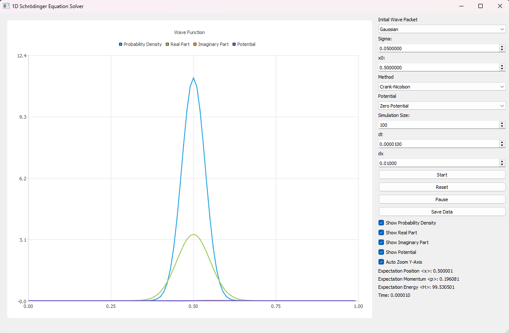

# 1D Schrödinger Equation Solver

A Qt-based application for numerically solving the time-dependent Schrödinger equation in one dimension. This application visualizes the evolution of quantum wave packets in various potentials using two different numerical methods.

## Features

- **Numerical Methods**:
  - Crank-Nicolson method (implicit finite difference)
  - Split-Step Fourier method
- **Initial Wave Packets**:
  - Gaussian wave packet
  - Plane wave
- **Potentials**:
  - Zero potential (free particle)
  - Harmonic oscillator
  - Square well
  - Double well
- **Real-time Visualization**:
  - Probability density |ψ(x,t)|²
  - Real and imaginary parts of the wave function
  - Potential energy function
- **Expectation Values**:
  - Position ⟨x⟩
  - Momentum ⟨p⟩
  - Energy ⟨H⟩
- **Data Export**: Save wave function data to CSV files

## Prerequisites

To build and run this application, you need:

- Qt 5.15 or later (with Qt Charts module)
- FFTW 3.3.5 (for Split-Step Fourier method)
- Eigen 3.4.0 (for linear algebra operations)
- Microsoft Visual Studio (for Windows) or GCC/Clang (for Linux/macOS)

## Building

### Windows

```bash
qmake SchrodingerSolver.pro
nmake  # or jom for parallel builds
```

## Usage

### Interface Overview

  <!-- Add a screenshot if available -->

The application consists of two main areas:
1. **Visualization Area**: Shows the wave function components and potential
2. **Control Panel**: Allows configuration of simulation parameters

### Simulation Parameters

- **Initial Wave Packet**:
  - *Gaussian*: Configure with σ (width) and x₀ (center position)
  - *Plane Wave*: Configure with k₀ (wave number)

- **Method**: Select between Crank-Nicolson and Split-Step Fourier

- **Potential**: Choose from Zero Potential, Harmonic Oscillator, Square Well, or Double Well

- **Simulation Size**: Number of grid points (100-10000)

- **dt**: Time step for the simulation

- **dx**: Spatial step size

### Controls

- **Start**: Begin the simulation
- **Reset**: Reset the simulation to initial conditions
- **Pause/Resume**: Pause or continue the simulation
- **Save Data**: Export the current wave function to a CSV file

### Visualization Options

- Toggle visibility of:
  - Probability density |ψ(x,t)|²
  - Real part of ψ(x,t)
  - Imaginary part of ψ(x,t)
  - Potential energy function V(x)
- Auto zoom Y-axis for better visualization

### Real-time Data

The application displays real-time expectation values:
- Position ⟨x⟩
- Momentum ⟨p⟩
- Energy ⟨H⟩
- Simulation time

## Numerical Methods

### Crank-Nicolson Method

An implicit finite difference method that is second-order accurate in both time and space. It is unconditionally stable, which allows for larger time steps compared to explicit methods.

### Split-Step Fourier Method

A spectral method that decomposes the evolution operator into kinetic and potential parts. It alternates between position and momentum space using Fast Fourier Transforms (FFTW library).